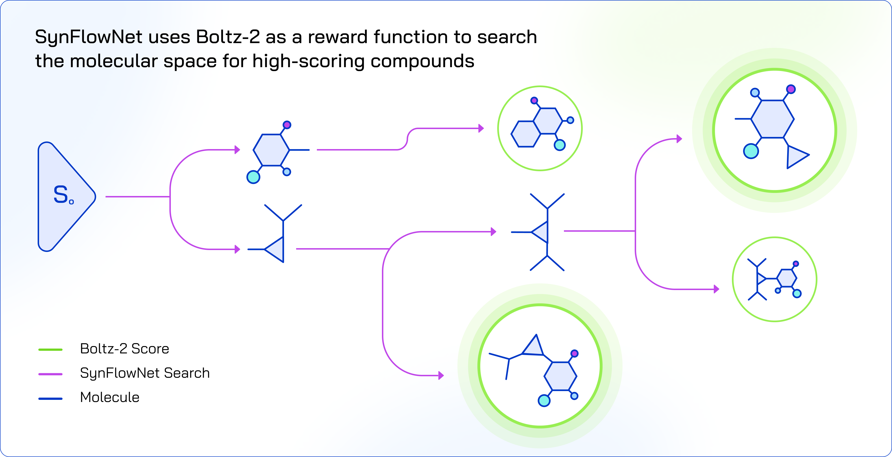

[](https://www.python.org/downloads/)
[](https://arxiv.org/abs/2405.01155)
[](https://www.biorxiv.org/content/10.1101/2025.06.14.659707v1)

This repository contains the code for running generative screens with SynFlowNet and Boltz-2. Combining these two models allows to search the chemical space for diverse and synthesizable compounds that yield high binding affinity scores according to Boltz-2 predictions.

# Purpose

> [!NOTE] 
> **The main purpose of this repository is to offer a simple interface between SynFlowNet and Boltz-2 for running generative screens.**

SynFlowNet is a GFlowNet model that generates molecules from chemical reactions and available building blocks. A SynFlowNet model is trained on a reward function to learn to sample synthesisable molecules with a probability proportional to their reward. Here we focus on **training SynFlowNet models using Boltz-2 as a reward function**. The current repository provides features allowing to leverage such computationally expensive reward functions. It extends the original [synflownet-repo](https://github.com/mirunacrt/synflownet) codebase, itself built upon the [recursionpharma-gflownet-repo](https://github.com/recursionpharma/gflownet).



To use SynFlowNet with computationally *less* expensive reward functions, it might be more advisable to simply start from the original [synflownet-repo](https://github.com/mirunacrt/synflownet). To use Boltz-2 for a different purpose such as screening a fixed molecular library, please refer to the [boltz-repo](https://github.com/jwohlwend/boltz).

# Installation

Running SynFlowNet-Boltz screens requires installing two separate environments:

1. A `boltz-env` for running the Boltz-2 workers. Start by installing boltz from the [Boltz-2 repository](https://github.com/jwohlwend/boltz) at commit `8b1627c` and add the `medchem` and `lilly-medchem-rules` packages:

```
git clone https://github.com/jwohlwend/boltz.git
cd boltz && git checkout 8b1627c
pip install -e .

pip install medchem
conda install lilly-medchem-rules
```

2. A `synflownet-env` for running the SynFlowNet trainer. This package must be installed from the current repository:
```
conda create -n synflownet-env python=3.10
pip install -e . --find-links https://data.pyg.org/whl/torch-2.7.0+cu126.html
```

Optionally, you can install the development environment instead:
```
pip install -e '.[dev]' --find-links https://data.pyg.org/whl/torch-2.7.0+cu126.html
```

For formatting and linting, run the following command:
```
pre-commit run --all-files
```

# Launching a screen

Please refer to [synflownet-boltz-launcher/README.md](synflownet-boltz-launcher/README.md) for instructions.

# Bibtex

If this repository is useful to your research, please consider citing the following works:

[](https://www.biorxiv.org/content/10.1101/2025.06.14.659707v1)
```
@article{
passaro2025boltz, title={Boltz-2: Towards Accurate and Efficient Binding Affinity Prediction}, author={Passaro, Saro and Corso, Gabriele and Wohlwend, Jeremy and Reveiz, Mateo and Thaler, Stephan and Ram Somnath, Vignesh and Getz, Noah and Portnoi, Tally and Roy, Julien and Stark, Hannes and others}, journal={bioRxiv}, pages={2025--06}, year={2025}, publisher={Cold Spring Harbor Laboratory}
}
```

[](https://arxiv.org/abs/2405.01155)
```
@article{
cretu2025synflownetdesigndiversenovel, title={SynFlowNet: Design of Diverse and Novel Molecules with Synthesis Constraints}, author={Miruna Cretu and Charles Harris and Ilia Igashov and Arne Schneuing and Marwin Segler and Bruno Correia and Julien Roy and Emmanuel Bengio and Pietro Liò}, year={2025}, eprint={2405.01155}, archivePrefix={arXiv}, primaryClass={cs.LG}
}
```
